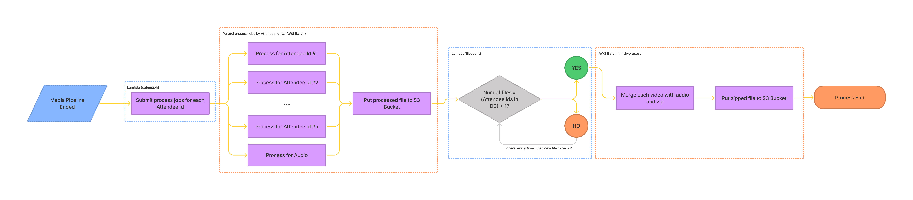

# Amazon Chime SDK Recording Post Process Script - MultiNode

Post process script for Amazon Chime SDK Recording files with multi node environment.

## Why do I need this?
Recording feature [officially added](https://aws.amazon.com/jp/blogs/business-productivity/capture-amazon-chime-sdk-meetings-using-media-capture-pipelines/) on July 7th, 2021 and available from [amazon-chime-sdk^2.13.0](https://github.com/aws/amazon-chime-sdk-js/tree/v2.13.0). 

The audio and video files are chunked into 5-second pieces and stored in specified S3 bucket. By default, **audio** folder contains the video stream of active speaker with the audio from all attendees. However you can capture individual video streams if you contact AWS support. 

This script will do followings on Docker images with different batch jobs by attendeeId.
  - concat the chuncked audio and video files
  - merge the audio and individual video streams

## Workflow

## Requirements
  - NodeJS^10
  - AWS Batch
  - Amazon ECS (Docker Environment)

## Environment
This script is intended to use on AWS Batch with AWS EC2 environment.
  
  ### Environment Variables
  - AWS Credentials (AWS_ACCESS_KEY_ID, AWS_SECRET_ACCESS_KEY)

    **Following must be authorized to perform.**
    - S3 FullAccess
  
  - meetingId

    This is an issed ID by Amazon Chime SDK that is returned by performing `Chime.CreateMeeting`.

  - bucketarn

    S3 bucket ARN which contains recording files.

## How to use
  1. Clone in to any folders (following indicated by ~).
  2. Check whether AWS CLI is installed on your environment (cf. `aws --version`)
  3. Run `sh CreateTemplate.sh` (not created yet!). This will automatically create CloudFormation Stack on your AWS Account.
  4. Call submitJob function (Lambda) to start Post Process after recording has finished.
  5. Call finish-process batch job to merge audio & videos and create zipped file.
  6. Zipped file will be automatically uploaded to specified S3 Bucket.